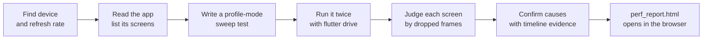

# Flutter Performance Tester

[](LICENSE)
[](https://code.claude.com)


A [Claude Code](https://code.claude.com) skill that finds jank in a Flutter app on a real Android phone. You get an HTML report of the screens that stutter: how badly, why, where in the code, and a prompt you can paste to fix it.

> **It measures and reports. It never edits your app code.**

## Contents

- [Quick start](#quick-start)
- [How it works](#how-it-works)
- [The report](#the-report)
- [Time and token usage](#time-and-token-usage)
- [How the verdict works](#how-the-verdict-works)
- [What it writes into your project](#what-it-writes-into-your-project)
- [Using the scripts on their own](#using-the-scripts-on-their-own)
- [Repository layout](#repository-layout)
- [Troubleshooting](#troubleshooting)

## Quick start

**Requirements**

- Claude Code
- Flutter SDK (Dart included) on the PATH
- An Android phone with USB debugging on, unlocked during the run. An emulator works, but its numbers are only indicative.

iOS devices are not tested yet.

**Install as a plugin**

```
/plugin marketplace add ErenMlg/erenmlg-flutter-performance
/plugin install erenmlg-flutter-performance@erenmlg
```

**Run it** in a Flutter project with the phone attached:

```
/erenmlg-flutter-performance:erenmlg-flutter-performance
```

<details>
<summary>Install without the plugin system</summary>

```bash
git clone https://github.com/ErenMlg/erenmlg-flutter-performance
cp -r erenmlg-flutter-performance/skills/erenmlg-flutter-performance ~/.claude/skills/
```

Then run it with `/erenmlg-flutter-performance`.
</details>

The skill runs only when you call it. Mentioning performance in a chat does not start it.

## How it works



After you start it, the skill does the rest without commands from you:

1. **Prepares the phone.** It finds the device, reads its refresh rate and hardware profile, and checks that battery saver is off and the phone isn't hot or throttled.
2. **Asks you one question:** should the test data it adds to fill empty screens be deleted afterwards?
3. **Writes the test.** The test opens and scrolls every screen and taps everything a user can tap. It skips destructive controls (delete, reset, log out, pay…) and controls that leave the app (share, camera, files…). Toggles are switched back. Dialogs are closed without pressing their buttons. If the app has an English translation, the test runs it in English without touching the phone's language setting.
4. **Measures** in profile mode on the device, twice, so a problem counts only when every run shows it.
5. **Explains each finding** with the timeline events that took the time and points to the code location.

## The report

`perf_report.html` is written to your project root and opened in your default browser. It contains:

- **Smoothness score.** The share of frames the app delivers on time.
- **Fix these first.** Problems shared across screens, the most impactful first. Each has a self-contained prompt you can copy to any coding agent.
- **Only the screens that stutter.** Each comes with a per-frame chart against the budget, the events that took the time, UI and Raster thread numbers, and the recommended fix.
- **Not tapped / test data.** Which controls were skipped on purpose and what data was added.

After you apply a fix, run the skill again. It compares the new runs with the earlier ones and marks each fix as *worked*, *made it worse* or *no effect*.

## Time and token usage

Measured on one complete run: a 9-screen Flutter app on a Redmi Note 8 Pro (Android 11, 60 Hz), with Claude Opus 5.5. The skill ran end to end without any input from the user.

| Phase | Time |
|---|---|
| Prepare: device checks, read the app, write the sweep test | 4 min 44 s |
| Measure: build plus two full sweeps on the phone | 5 min 42 s |
| Analyze and write the report | 2 min 20 s |
| **Total** | **12 min 46 s** |

| What was measured | |
|---|---|
| Screens | 9 |
| Measurements in the report | 39 (9 opens, 7 scrolls, 23 taps) |
| Full sweeps on the device | 2 (the second one repeats only the flagged taps) |

| Tokens | Count |
|---|---|
| Output | 35.5 K |
| Input, not cached | 162 |
| Cache writes | 144 K |
| Cache reads | 9.05 M |
| **Total** | **9.23 M** (98 % cache reads) |
| API calls | 69, no subagents |

Expect the time and tokens to grow with the number of screens and tappable controls. A first run also pays for writing the sweep test. Later runs reuse that test and go straight to measuring.

## How the verdict works

A screen is judged by what a user sees, not by raw thread timings.

| Dropped frames (1 − delivered fps ÷ refresh rate) | Verdict |
|---|---|
| under 3 %, no hitch longer than 3 frame budgets | Smooth (not listed) |
| 3 % or more, or one hitch longer than 3 budgets | Slightly janky |
| 10 % or more | Janky |

- **Device floor.** Every sweep starts by scrolling a plain list with no app code. Whatever the phone drops on that list is its floor. Verdicts count only what the app drops above the floor, so an older phone's own limits are not blamed on your app.
- **Short actions** (under 60 frames, such as screen openings and most taps) are judged by missed frames instead: 3 or more is slightly janky, 6 or more is janky.
- **Unsure.** If one run stutters and another doesn't, the difference is within the phone's noise. Such screens are counted but not listed.
- **Bottleneck.** UI and Raster p90 show where the time goes. The UI thread runs your Dart code; the Raster thread draws on the GPU.

The frame budget follows the device: 16.7 ms at 60 Hz, 11.1 ms at 90 Hz, 8.3 ms at 120 Hz.

## What it writes into your project

| Path | What |
|---|---|
| `integration_test/*_perf_test.dart` | the measurement test |
| `test_driver/perf_driver.dart` | saves every run to `perf_runs/` |
| `perf_runs/` | frame summaries and full timelines (~10 MB per run, add it to `.gitignore`) |
| `perf_report.json`, `perf_report.html` | the report data and page |
| `pubspec.yaml` | `integration_test` and `flutter_driver` dev dependencies, if missing |

Nothing under `lib/` is touched. On the device, the test may add clearly named test data for screens that need it, and deletes it afterwards if you said so.

## Using the scripts on their own

The bundled Dart scripts need only the Dart SDK:

```bash
# One line per measured screen, worst first
dart skills/erenmlg-flutter-performance/scripts/compare_perf.dart --summary=perf_runs --fps=60

# Detailed numbers and verdict for one screen
dart skills/erenmlg-flutter-performance/scripts/compare_perf.dart \
  perf_runs/home_scroll.1.json perf_runs/home_scroll.2.json --fps=60

# Where the time went in one trace
dart skills/erenmlg-flutter-performance/scripts/timeline_top.dart perf_runs/home_scroll.1.timeline.json

# Build the HTML report
dart skills/erenmlg-flutter-performance/scripts/html_report.dart perf_report.json
```

**CI gate.** `compare_perf.dart` exits with 1 on a failing verdict and accepts `--baseline=` and `--regression-only`. Copy it into your repo and compare against committed baseline runs from the same device.

**Re-measuring one screen.** Pass `--dart-define=PERF_ONLY=<key>,<key>` to `flutter drive`. These runs are saved as `<key>__isolated` and only prove the screen can be reached. A lone screen on an idle phone measures faster than the same screen inside a sweep, so the scripts refuse to compare the two.

## Repository layout

```
.claude-plugin/
  marketplace.json            marketplace "erenmlg"
  plugin.json                 plugin manifest
skills/erenmlg-flutter-performance/
  SKILL.md                    the workflow Claude follows
  assets/                     test templates copied into your app
    app_sweep_test.dart       whole-app sweep: open, scroll, tap every screen
    perf_test.dart            single-scenario test
    perf_driver.dart          host driver that saves numbered runs
  scripts/                    analysis, run with `dart`
    compare_perf.dart         numbers, verdict, baseline comparison
    timeline_top.dart         top events in one trace
    html_report.dart          the HTML report
  references/                 how to confirm a cause and which fix to recommend
    ui-thread.md
    raster-thread.md
```

## Troubleshooting

| Symptom | Cause and fix |
|---|---|
| `Unable to establish loopback connection` during the Gradle build | Seen in sandboxed shells on Windows. The skill sets `JAVA_TOOL_OPTIONS=-Djdk.net.unixdomain.tmpdir=<~/.gradle/uds>` and retries. |
| "only N frames" warning | The screen was off or locked during the run. Unlock the phone and run again. |
| Every screen looks slow | The phone is hot, on battery saver or low on battery. The skill checks this before each sweep and tells you. |

## License

[MIT](LICENSE) © Eren Mollaoglu
